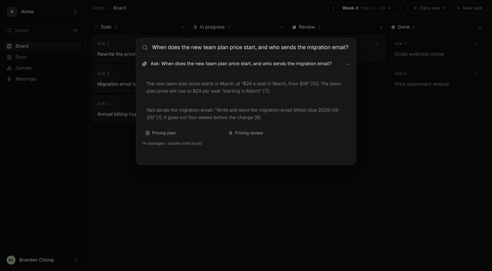
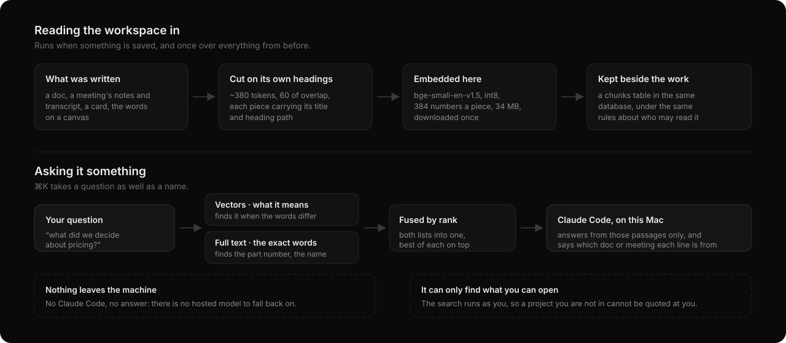
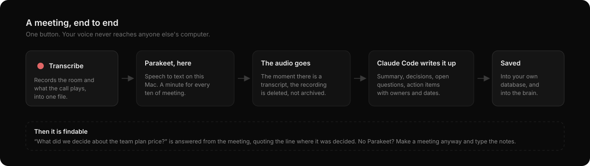
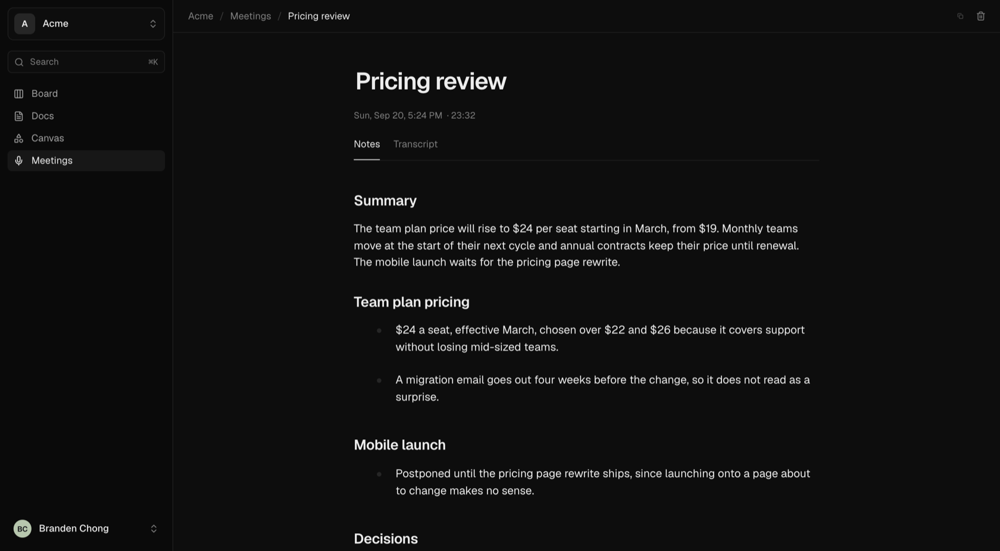
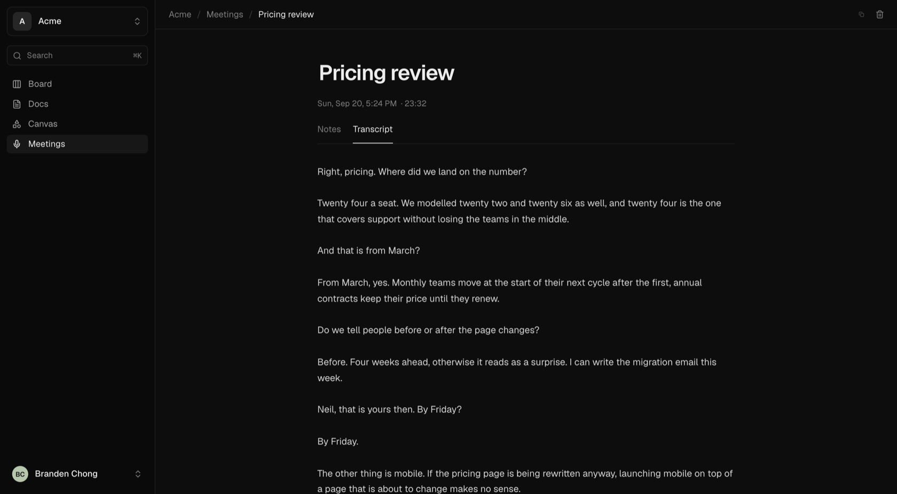

<p align="center">
  
</p>

<p align="center">
  <b>Your company's brain, in a database you own.</b>
</p>

<p align="center">
  <a href="LICENSE"></a>
  
  
  
</p>

<p align="center">
  
</p>

Alfredo is a Mac app with four tabs, **Board, Docs, Canvas and Meetings**, that
answers questions about everything written in them. It records and transcribes
your meetings on your own machine, and it hands the whole workspace to whatever
AI you already use through an MCP server, so you can say "what did we decide
about pricing" or "put last week's unfinished cards in this cycle" and mean it.
Claude Code, Cursor, VS Code, Zed: anything that speaks MCP.

There is no account, no server of ours, and no subscription. Each workspace
lives in a database you choose: a folder on this Mac, your Supabase project, or
your Cloudflare account.

## What it replaces



| Instead of | Alfredo's tab | Their list price, per person, per month |
| --- | --- | --- |
| [Linear](https://linear.app/pricing) Business | Board: cards, cycles, backlog | $16 |
| [Notion](https://www.notion.com/pricing) Business | Docs, and the AI that reads them | $20 |
| [Miro](https://miro.com/pricing/) Business | Canvas: frames, stickies, arrows | $20 |
| [Granola](https://www.granola.ai/) Business | Meetings: transcripts and notes | $14 |
| [Glean](https://www.glean.com/)-class search over all of it | Ask it anything, with citations | $45 to $75, with a seat minimum |

Prices as published in September 2026. A team of ten pays about **$8,400 a
year** for the first four. Alfredo is MIT licensed and costs nothing; the only
bill is the database, which is free on this Mac, free on Supabase and Cloudflare
at the sizes a workspace runs at, and yours either way.

That is not a claim that Alfredo is as good as any of them at their own game.
It is one app, built for a team that would rather own the data and the bill.

## Run it

Needs Node 22 or newer.

```sh
npm install
npm run dev              # http://localhost:5210
```

On a Mac, build and install the app itself:

```sh
npm run desktop:install  # /Applications/Alfredo.app
```

The first screen asks where your first workspace should live. Nothing else is
required to start.

### Where it runs

Most of Alfredo is Node, WebAssembly and a browser, so it runs wherever those
do. Two things are genuinely Apple's, and the app says so rather than pretending:

| | macOS (Apple silicon) | Linux and Windows |
| --- | --- | --- |
| Board, Docs, Canvas, projects, people | Yes | Yes |
| Your database: this machine, Supabase, Cloudflare | Yes | Yes. The local one is PGlite, which is WebAssembly |
| The brain: chunking, embeddings, hybrid search | Yes | Yes. The embedding model has Linux and Windows builds |
| MCP server for your own AI | Yes | Yes |
| Meetings you write yourself | Yes | Yes |
| **Recording a meeting** | Yes, room and call together | No. System audio comes from ScreenCaptureKit |
| **Transcribing it here** | Yes, Parakeet on Apple silicon | No. Set `OPENROUTER_API_KEY` to transcribe elsewhere instead |
| **A packaged desktop app** | Yes | Not yet. Electron is cross-platform; only the build target is set up for macOS |

Secrets live in the macOS keychain where there is one, and in a `0600` file
beside the workspace registry where there is not.

Checked by running the server with the platform reported as Linux: workspaces,
docs, meetings, the local PGlite database and the MCP server all work, and
Meetings says recording needs a Mac instead of offering a download that cannot
run. Nobody has yet run it on real Linux or Windows hardware, so if you do, say
how it went.

## Everything goes through the database



There is no Alfredo backend. The app talks to one database per workspace, and
every last thing it knows lives in there: cards, docs, canvases, meetings,
people, roles, invitations, which tabs the workspace has, and the passages the
brain searches. Switching workspace switches database.

| Where | Good for | Setup | Enforced by |
| --- | --- | --- | --- |
| **This Mac** | Yourself, offline | None. A folder under `~/.alfredo/workspaces` | Nothing to enforce: one person |
| **Supabase** | A team | Paste a personal access token, Alfredo creates the tables | Postgres row-level security |
| **Cloudflare D1** | A team, on your own account | One click with your `wrangler` login | A Worker that owns the only door to D1 |

- Supabase: `db/schema.sql` and `db/policies.sql`, both safe to run again.
- Cloudflare: `cloudflare/schema.sql` and `cloudflare/worker.mjs`.
- This Mac: the same schema, in PGlite (Postgres compiled to WebAssembly).

Because the rules live in the database, the app is not what stands between a
teammate and a project they are not in. An invited teammate's copy of Alfredo
holds no secret key at all: it connects with the publishable key and their own
sign-in, and the list of projects they see is Postgres's answer, not the app's.

Moving a workspace between databases is a matter of pointing Alfredo at the
other one; nothing of yours is left behind on a machine of ours, because there
isn't one.

## The brain: asking your own writing



Everything written in a workspace is cut into passages, embedded, and kept in a
`chunks` table beside the work itself. A question searches those passages two
ways at once and hands the best of them to Claude Code, which answers from them
and says where each claim came from.

**Reading it in.** A doc, a meeting's notes and transcript, a card or the words
on a canvas get cut on the writing's own headings, about 380 tokens a piece with
60 tokens of overlap, and every piece carries its title and heading path in
front of it, so a paragraph that says "we went with the second option" still
knows what it is an option about. Retrieval lives or dies on that, far more than
on the model. New work is read in as it is saved; everything from before is read
in once, from Settings, Models (or `read_workspace_in` over MCP).

**The model.** `bge-small-en-v1.5`, quantised to int8: 384 numbers a passage,
about 34 MB, downloaded on first use and then never online again. It is small on
purpose. What makes retrieval good is the chunking, a lexical pass beside the
vectors, and fusing the two.

**Searching.** Two lists, fused by reciprocal rank. The vectors find the
passage that means what you asked even when it uses different words; full-text
finds the exact part number, name or phrase that vectors always miss. Fusing
them means neither has to be right on its own.

**Answering.** Claude Code, on this Mac, from those passages only, with the
bracketed number of each passage it used. When the workspace does not say, it
says so rather than filling the gap. There is no hosted fallback: a company's
own writing is the last thing to hand to a service nobody chose.

**What it may find.** The search runs as whoever is asking, through the same
row-level security as the work, so a project you are not in cannot be quoted at
you. Ask inside a project and the answer stays inside it.

⌘K takes a question as well as a name. The citations are chips: click one and
the doc or meeting opens.

## Meetings



Press **Transcribe**. Alfredo records the room and what the call is playing,
turns it into text on this Mac with [Parakeet](https://github.com/FluidInference/FluidAudio),
and deletes the audio the moment a transcript exists. Claude Code then writes
the note: summary, decisions, open questions, and action items with owners and
dates resolved (nobody lets the model do date arithmetic; it says "by Friday"
and the code works out which Friday). The meeting is saved to your database and
read into the brain, so the next question can quote it.

Meetings offers to download Parakeet the first time, about 600 MB, needing
Xcode's command line tools. No Parakeet and no Claude Code still leaves you a
working tab: **New meeting** makes one you type the notes into yourself.



The transcript is one click away, and it is the only copy of the meeting that
survives:



Connect Google Calendar in Settings, Connections, and what is coming up appears
above the list with a Transcribe button on each.

## Any MCP client, not just Claude

Alfredo runs a plain [MCP](https://modelcontextprotocol.io) server over
streamable HTTP at `http://127.0.0.1:29981/mcp`. There is nothing
Claude-specific in it: any client that speaks MCP can list the tools and call
them.

```sh
# Claude Code
claude mcp add --transport http alfredo http://127.0.0.1:29981/mcp
```

```json
// Cursor (~/.cursor/mcp.json), VS Code, Zed, Windsurf, Goose and the rest
// take the same thing in their own config file:
{ "mcpServers": { "alfredo": { "url": "http://127.0.0.1:29981/mcp" } } }
```

A client that only speaks stdio can bridge with
`npx mcp-remote http://127.0.0.1:29981/mcp`. Add the header
`x-workspace: <id>` to pin one workspace; otherwise calls go to the active one.

Two of the tools matter most, and they split along exactly this line:

- **`search_workspace`** hands back the passages and where each came from, and
  nothing else. Whatever model your client runs writes the answer. This is the
  one to use from Cursor, Zed, VS Code or your own SDK client.
- **`ask_workspace`** writes the answer as well, using Claude Code on this Mac.
  It needs `claude` on your PATH, because that is the only model Alfredo will
  show a company's own writing to.

Then talk to it:

> "Connect my Supabase project Acme to a new workspace called Acme."
> "What did we decide about the team plan price, and which meeting was it?"
> "Make a project called Website, put Neil in it as an editor, and move the
> three pricing docs into it."
> "Read the whole workspace in, then tell me what is unfinished this cycle."

| Tool | Does |
| --- | --- |
| `list_workspaces` | Every workspace and where it lives |
| `ws_list`, `ws_read`, `ws_write` | Cards, docs, canvases, meetings, members |
| `get_workspace`, `set_workspace_tabs` | The workspace's name and its tabs JSON |
| `ask_workspace`, `search_workspace` | Answer from the workspace's own writing, with citations |
| `read_workspace_in`, `brain_status` | Read everything in, and see how far it got |
| `list_projects`, `create_project`, `set_project_people`, `move_to_project`, `set_projects_enabled` | Projects, and who is in them |
| `invite_person` | An invite link to send someone |
| `list_pack_data`, `get_pack_data`, `set_pack_data` | Data for tab types you add yourself |
| `list_supabase_projects`, `connect_supabase` | Add a Supabase workspace |
| `get_setup_sql`, `setup_supabase_tables` | Create or upgrade its tables |
| `connect_cloudflare`, `create_cloudflare_workspace`, `get_cloudflare_deploy` | Add a Cloudflare workspace |

The server binds to 127.0.0.1, refuses browser origins and foreign hosts, and
holds database keys, so it never listens on the network.

### Do you need Claude at all?

No. The board, docs, canvas, meetings, projects and search all work with no AI
of any kind. Transcription is Parakeet, on your Mac. Search is the embedding
model, on your Mac.

Two things use a model, both through Claude Code, locally: writing up a meeting,
and writing the prose answer to a question. Without it you still get the
transcript and the passages, and any MCP client can turn those into an answer
with its own model.

## People, projects and who may see what

Whoever connects the database and makes the first account runs the workspace.
They invite the rest with a link, put each person in the projects they need, and
give each a role there: runs it, can edit, or read only. Admin can be handed to
someone else. All of it is rows in the workspace's database, so it travels with
the workspace rather than with a Mac.

**Projects** are off until a workspace turns them on. They split one workspace
into separate boards, docs, canvases and meetings inside the same database, and
you switch between the ones you are in, under the workspace name. There is no
"all projects" view: you see the projects you were let into.

An invite link carries where the workspace is and nothing secret. Paste it into
Alfredo (Add workspace, "I have an invite"), sign in with that email, and you
land in the projects the invitation names.

**Sign in with Google** works on Supabase workspaces whose project has the
Google provider on. Google will not sign anyone in inside an app window, so
Alfredo opens the system browser and catches the answer on
`http://127.0.0.1:29981/auth/callback`; add that to the project's redirect URLs.

## Making it yours

**Tabs are data, not code.** Every workspace keeps a tabs JSON in its own
database. Rename them, hide them, reorder them, or add your own:

```json
[
  { "id": "board", "type": "board", "name": "Board", "columns": ["Todo", "In progress", "Review", "Done"] },
  { "id": "docs", "type": "docs", "name": "Docs" },
  { "id": "canvas", "type": "canvas", "name": "Canvas" },
  { "id": "meetings", "type": "meetings", "name": "Meetings", "hidden": true }
]
```

Rename the board's columns per workspace with `columns`. Any other `type` is a
**pack**: a folder in `src/v2/packs/<name>/` whose `index.ts` exports `tabs`,
keyed by type. A pack's data goes in the workspace's database through the pack
data tools, never in the code, so a tab you invent travels with the workspace
like everything else.

**Cycles** run 1, 2 or 4 weeks. When one ends you decide what happens to
unfinished work: ask every time, roll it into the next cycle on its own, or send
it back to the backlog. Whatever the setting, **Carry over** on the board moves
what is unfinished whenever you say so, into the next cycle, the one running
now, or the backlog.

**The canvas** is React Flow JSON, so a board made elsewhere in that format
opens unchanged. Frames carry what is inside them, the hand tool pans from
anywhere, scroll pans and ⌘-scroll zooms.

**Docs** list as a grid or a table, whichever you leave it on.

## What leaves your machine

Nothing, unless you ask for it.

| | Where it happens |
| --- | --- |
| Transcription | Parakeet, on this Mac. Only if you have no Parakeet *and* you set `OPENROUTER_API_KEY` does audio go to a hosted model instead |
| Meeting write-ups | Claude Code, on this Mac, or not at all |
| Answers from the brain | Claude Code, on this Mac, or not at all |
| Embeddings | On this Mac, by a model downloaded once |
| Your work | The database you chose, and nowhere else |

Keys and tokens live in the macOS keychain. `.env.local` is optional; see
`.env.local.example`.

## Building on it

```sh
npm run dev              # app on 5210, server on 29982
npm run build            # the web build
npm run desktop:install  # build the Mac app and put it in /Applications
npm run db:push          # apply db/schema.sql and db/policies.sql to a Supabase project
```

The app is Svelte 5 with runes. The server is Hono, one route file per
area under `server/`, with a `Store` interface each database kind implements
(`SqlStore` for Supabase and PGlite, `CloudflareStore` over the Worker), so a
feature is written once and works on all three.

## License

MIT. See [LICENSE](LICENSE).
